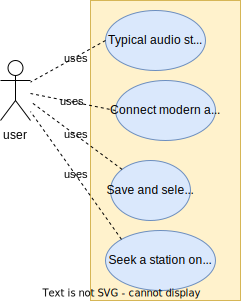

# Introduction and goal

The aim of this project is to use an old radio Philips Hurricane de Luxe and connect it to modern audio channels so that we may stream music on it. The loudspeaker is still good. Another aim is to train in technologies such as RTOS programming, schematic and PCB design as well as project management.

## Functional requirements:

|ID|Description|
|:-:|:-:|
| FR_1 | Play audio from a modern audio source technology so that we shall use it with music stream application |
| FR_2 | Still be able to demodulate FM audi source and select between modern stream (*FR_1*) and FM radio |
| FR_3 | (*OPTIONAL*) Be able to decode DRS from FM channel should be possible |
| FR_4 | Control volume level and select audio source: FM or modern stream |
| FR_5 | (*OPTIONAL*) Be able to use it without a permanent power supply (be nomad) |
| FR_6 | Save FM stations in favorites and select them after a radio restart |

**Use case diagram:**

|Usecase|Name|Description|
|:-:|:-|:-|
|usecase 1| Typical audio stream control | Provides typical audi controls, like next track, previous track, play/pause, volume control, etc... |
|usecase 2| Connect modern audio stream| User is able to connect a "modern" device, like his smartphone, to the system and to stream audio on it|
|usecase 3| Save and select FM stations| User may save a prefered FM station to a list of 5 presets and select them after a radio restart (power off). This favorites list shall save the FM frequency, and if possible (*OPTIONAL*) FM station should have their name saved too |
|usecase 4| Seek a station on FM radiowaves | User shall be able to trigger a seek on FM band in a direction (frequency increasing or decreasing) and radio shall be able to stop on a "correct" station. Correct means, audio quality is acceptable |

## Quality goals:

There are no special quality goals in a first phase as it is:  
1) A project for fun
2) To test different technologies
3) No special certification has to be done and it won't be sold

Some are nevertheless described, and are all optional

|ID|Description|
|:-:|:-:|
|QG_1| **Performance**: radio should be at least quite stable and not bug all the time |
|QG_2| **Small footprint**: radio should keep it power consumption reduced as we are not building a Ghetto Blaster (could be fun though) |

## Stakeholders:

None, except me only. Benevolent dictator for life

## Constraints

List of all constraints limiting solution choices and strategies. Either selected by me or are induced by actual situation

### Organizational constraints
|ID|Description|
|:-:|:-:|
|OC_1| Work alone and as a side project, means limited time of development|
|OC_2| Budget is limited as it should not be an expensive radio, but more for fun|

### Technical constraints
|ID|Description|
|:-:|:-:|
|TC_1| As Android and iPhone are the most knwon sources of audio stream, the system must be compatible with their technologies |
|TC_2| PCB has to fit in radio and respect its mechanical fixation points. The aim is still to use the old boxing and interface of the Philips radio |
|TC_3| (*OPTIONAL*) As it mechanically perfectly fits and is quality is still good (tested with direct plug on differential input), the system should use the old 8 Ohms 2,5 Watts loudspeaker |

[< prev (README)](../README.md) - [next > (Context & Scope)](../01_Analysis/ARC42_ContextAndScope.md)

