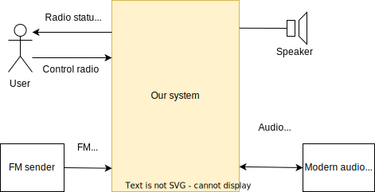
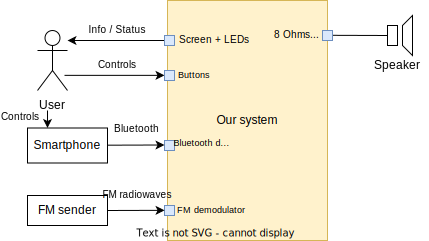

# Context and scope

In this part are explained the context in which the device is, on a business point of view (features, interactions, qualities required) as well as on a technical point of view, which means which technologies are used and where

## Business context

|Entity|Purpose/Interaction|
|:-:|:-|
|User| Controls the radio. It can execute nextPrevious track, control volume level, search FM channel or save/search one, etc... User has also a second channel, which is from our system, to the User and it provides information about status, track played and so on...|
|FM sender| Is the FM sender antenna, it provides different station and use the standard FM network|
|Modern audio stream| Is the source of audio stream, it must respect constraints described in part I|
|Speaker| Is the speaker to output audio |

## Technical context

|Entity|Technical interface|
|:-:|:-|
|User| Uses buttons and screen to interact with radio|
|FM sender| Will be demodulated with a modern FM demodulator chip which also provide RDS decoding |
|Modern audio stream| Use of Bluetooth protocol to stream audio on radio. This protocol has the advantage to be massively integrated in actual private portable devices|
|Speaker| Keep the loudspeaker as described in technical constraints. Use of an 8 Ohms 2-3 Watts differential amplifier |

## Solution strategy

### Control radio
For the interaction with human user, rotary encoders were selected. They can mechanically easily be mounted on Philips Radio. Old potentiometers are more complex to interface with the Bluetooth chip and modern FM demodulator. Indeed, those have industrial communication interfaces like I2C, SPI or UART and requires encoded binary messages to be controlled. Therefore, the action to turn button, must be first sent to a central unit, which convert the rotation direction into a command, understandable for the sub entity (Bluetooth chip, screen, FM demodulator...)

Rotary encoders generally also offers a push button when pushing their knob. It allows to have for all rotary encoders, the capacity to send 3 different signals to a microcontroller:
 - Direct rotation
 - Indirect rotation
 - Button pushed

Legacy push-buttons will however be re-used (**TC_3**), as they are simple contact push-buttons on which a binary info may be sent to our system. They will be used to select radio mode, like switch between audio source, or power supply, or anything like that.

### Get radio status
Use of an e-paper screen to get info from radio (status, track metadata, etc...) This kind of screen is actually quite nice to use and present an advantage about power consumption. Waveshare epaper 5.83" was selected as it provides a ready-to-use API which is programmed in C.

### Modern audio stream
Use of AirPlay was rejected, as it would have made the radio too complex, increase development time and present the disadvantage to require a Wifi network to stream music on it. Airplay also has the disadvantage to have sometimes 1 or 2 seconds delay, as well as a long start-up time to connect to WiFi.  
Bluetooth is the best option as it is widely used in personal portable devices and has with the time evolved and present acceptable sound quality. Bluetoot chip RN52 from Microchip was selected as it is quite easy to integrate and presents a differential audio output.

### FM demodulator
si470x From Skyworks was selected for this role. The choice was made because Sparkfun propose an already finished hardwre module

### Audio output
To comply to consumption quality goals, and as sound quality of the project is not the main topic, a class D audio amplifier was selected. The PMA8203, which offers excellent results and a powerful sound, even when it is only 2.5W! It interfaces itself quite good with the old paper loudspeaker of the Philips radio (impedance and output power).  
 - For Bluetooth audio output, a TPA6112A 150 mW preamplifier is wired, prior to class D amplifier  
 - For si470x, it is directly plugged onto PMA8302 audio input.  
 - To switch between FM and Bluetooth audio sources, an audio switch from Texas Instruments TS5A2234 is placed between the different audio sources and has its output wired on PMA8302 input.

**Specific info about audio switch**:  
There is something quite welcome, it is the deactivation of RN52 and si470x, they are inverted. Which means, the line to select audio output can also be used to deactivate/activate the corresponding audio source. 

### (OPTIONAL) Battery
As desired as a optional feature of the project, a 12V battery will also be integrated in the project. There are main 12V batteries, of many different capacity. I took an old one from ma shelf of 1100 Ah.

#### Power consumption estimation
A small power consumption estimation of the project and the longevity of the battery in worst case:
|Element | Typical/Maximal consumption|
|:-:|:-|
|Central Unit (RP2040)| 40 mA max|
|BT (RN52) | 30 mA typical |
|FM (si470x)| 20 mA max|
|Audio (PMA8302)| 2,5 W|

Consumption worst case of all units without class D:  
With margin: 90 mA @ 3V3 = 300 mW

Consumption with class D audio module (at maximum level)  
2,5 + 0,3 = 2,8 W.

Consumption with class D audio module (typical level)  
1.25 + 0,25 = 1,5 W.

Our battery has:  
12 * 1,1 = 13,2 Wh of power, which means:  

| Working time typical | Working time at full power |
|:-:|:-:|
|13,2/1,5 = 8,8 hours |13,2/2,8 = 4,7 hours|

Which is quuiiiiiiite ok.

### Our system
The main element, our system will be progtrammed with a Raspberry Pico, having an RP2040 microcontroller. This uC presents quite the quantity of advantages:
 - Dual core (interessant for RTOS training)
 - Quite cheap
 - Enough I/O to be interfaced with all elements of project
 - Has a powerful SDK well documented, which uses CMake

[< prev (Intro and goals)](../00_Requirements_Inputs/ARC42_IntroAndGoals.md) - [next > (Architecture design)](../02_Architecture_Modelisation/ARC42_architectureMain.md)
