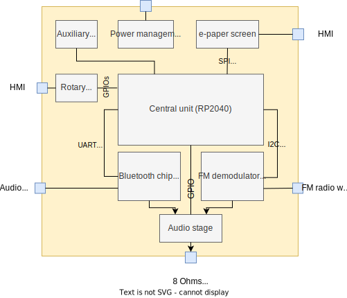

# Architecture description

This chapter describes the main architecture, first as a system view, complying to all requirement, quality goals and constraints.
Then it is split into Software, Hardware and Mechanical topics and architectures.

All issues and tickets about hardware and software topics are listed in [TICKETS](../00_Requirements_Inputs/TICKETS.md) file. As mechanical topics are rare and don't require many effort. No mechanical tickets are written.

## System architecture design

|Module| Purpose/Description| Interface|Technology| Nickname |
|:-:|:-|:-|:-|:-|
|Central Unit| Contains the software, interfaces almost all other modules and is the main entity of this system| All possible interfaces needed by other modules | RP2040 on a Raspberry Pico board | CU |
|Rotary encoders| Button interfaces with human. They can forward human commands to central unit: turned direct, turned indirect or pushed (they possess a push button too.) | 3 GPIOs are needed per Rotary Encoder | RE |
|Bluetooth Chip| Provide a Bluetooth connection to audio stream sources, retrieve information about connected device and track metadata and provide an audio differential output | GPIOs and UART are needed to control this device | RN52 | BT|
|FM demodulator | Can demodulate FM radiowaves and provide the audio output. It is also able to decode RDS metadata| I2C and UART are required to control this device | si470x| FM|
|e-paper screen| Is used to print all info, status, any kind of output judged as relevant for human user. Like track metadata, FM status or BT status | SPI is required | Waveshare e-paper 5.83" | EP |
|Audio Stage| Drives the 8 Ohms loudspeaker and switches between FM and BT modules depending on what CU orders | One GPIO is required | TPA6112A, PMA8302, TS5A2234 | AS |
|Power Management| Provide power supply to system. Is able to generate a 3.3V from either a 5V power supply, or a 12V power supply (battery)| USB plug and wires | LM317, NXE2S1205MC DC-DC converter |PM|
|Auxiliary Connector| Most of modules have debug interfaces as well as additional interfaces available. They are all gathered here, for future purpose if needed. SWD and UART of RP2040 are available here for debug| SPI, UART, GPIOs | Simple headers | AUX |

## Software architecture design

The software structural architecture is quite straigth-forward, as it doesn't have any particular complexity. Therefore, a simple layer architecture is quite enough:  

Modules Pico SDK and RP2040 Hardware are actually "out of project" as they are already made, external modules. They are part of the structural architecture, but no work is to be done here.

### Detailled description of modules:

|Module| Desription| Software directory |
|:-:|:-|:-|
|Application (main)| main module, (starts with main.c in program). Describes the wished radio behavior and uses the other modules beneath it to realize it | [Software/code](../03_Development/Software/code/) |
|re_Buttons| Driver for rotary encoders, it provides handles to whom want to be notified if a rotary encoder was turn, in which direction it was turned and if push button was triggered | [Software/code/re_Buttons](../03_Development/Software/code/re_Buttons/) |
|bt_rn52| Driver for Bluetooth chip Microchip's RN52. It uses UART and GPIOs to configure the RN52 chip, send command and read results. I2S inteface is not used. Audio stream is directly outputed to differential output | [Software/code/bt_rn52](../03_Development/Software/code/bt_rn52/)|
|fm_si470x| Driver of si470x chip, which provides FM demodulation. It uses I2C and GPIOs interfaces to configure, control and retrieve RDS data from Si470x chip |[Software/code/fm_si470x](../03_Development/Software/code/fm_si470x/)|
|rdsDecoder| Provide tools to decode RDS frames notified by si470x. This module is actually only used by fm_si470x module and may be integrated to it |[Software/code/rdsDecoder](../03_Development/Software/code/rdsDecoder/)|
|hmi_ePaper| Driver of Waveshare e-paper. It mainly uses already provided driver from waveshare, which was a little bit reconfigured and cleaned for lightness and simplicity |[Software/code/hmi_ePaper](../03_Development/Software/code/hmi_ePaper/)|

**Note:**  
The whole code is written in C and uses CMake for compilation.

